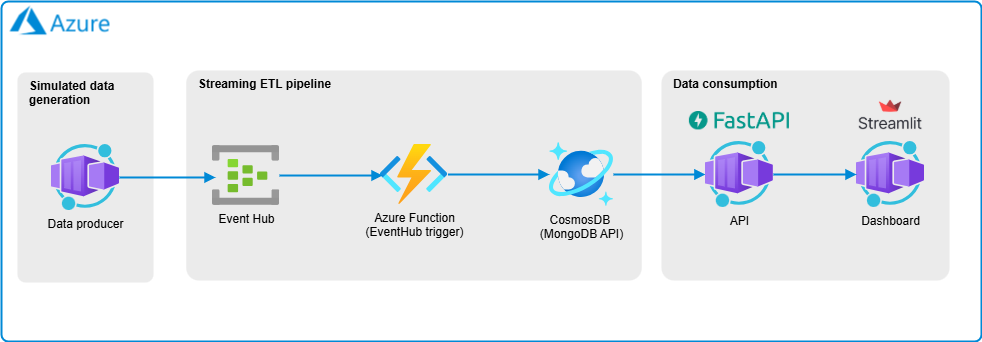

# Azure End-to-end - Exercise 1: Azure Container Apps & Azure Event Hub & Azure Functions & Azure CosmosDB

## **Objective**  

In this exercise, we will set up a **real-time event processing pipeline** using **Azure Container Apps**, **Azure Event Hub**, **Azure Functions** and **Azure CosmosDB (MongoDB API)**.  



## **Sample Data (JSON Messages in Event Hub)**  

Each message represents a **real-time transaction**:  

```json
{
  "transaction_id": "txn_1001",
  "customer_id": 1,
  "products": [
    { "product_id": 201, "quantity": 2, "price": 20.00 },
    { "product_id": 202, "quantity": 1, "price": 40.00 }
  ],
  "total_amount": 80.00,
  "timestamp": "2024-03-30T14:23:45Z",
  "payment_method": "Credit Card"
}
```

## **Steps**  

0. You should use **Terraform to automate the deployment of the Azure resources**.
1. Using a **Python script**, **publish JSON messages** with simulated sales transaction data to **Azure Event Hub**. The Python script should be containerized and **deployed in Azure Container Apps**.
2. **Create an Azure Function** that **is triggered** by **Event Hub**.
3. **Process and transform the data** in **Azure Functions**, **transforming the data** into a structured format.  
4. **Store the transformed data** into **Azure CosmosDB (MongoDB API)**. 

### **Azure Functions alternative**

- If you have trouble deploying your Azure Function to Azure, you can **try to use v1 functions instead of v2**, which are supposed to be more stable.
- You could also **substitute the Azure Function to process data with another container in Azure Container Apps**. 

## **Extra**
5. Deploy a **new Azure Container Apps with a Streamlit app** that reads the data from CosmosDB and shows a **dashboard with insights on the data**, like, for example, the total sales per payment method, total amount per product, most bought product... and anything else you can think of. Ideally, you should deploy **another container app with an API that will make the calls to CosmosDB** to expose the data instead of directly querying data from the Streamlit UI.

## **Resources**  

- 📌 [Azure Portal](https://portal.azure.com)  
- 📖 [Azure Event Hub Documentation](https://learn.microsoft.com/en-us/azure/event-hubs/event-hubs-about)  
- 📖 [Azure Functions Documentation](https://learn.microsoft.com/en-us/azure/azure-functions/)
- 📖 [Azure Cosmos DB Documentation](https://learn.microsoft.com/en-us/azure/cosmos-db/)
- 📖 [Azure Container Apps Docuentation](https://learn.microsoft.com/en-us/azure/container-apps)  
- 📖 [Streamlit Documentation](https://streamlit.io/)  
- 📖 [FastAPI Documentation](https://fastapi.tiangolo.com/)