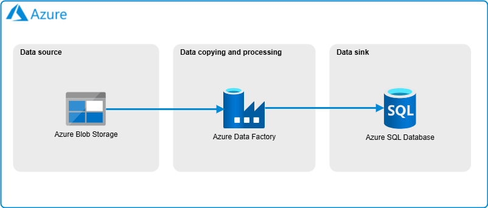

# Azure End-to-end - Exercise 2: Blob Storage & Data Factory & Azure SQL Database

## **Objective**  

In this exercise, we will define a batch **ETL (Extract, Transform, Load) process** using **Azure Blob Storage**, **Azure Data Factory**, and **Azure SQL Database**. We will ingest [sample retail data from **CSV files**](../../1-Storage/Exercise02/data/), and load it into an **Azure SQL Database** using **Azure Data Factory** pipelines.

## **Steps**  

1. **Upload sample CSV files** to **Azure Blob Storage**.  
2. **Use Azure Data Factory** to **ingest the data** into an **Azure SQL Database**. Insert **each CSV into its own table** and also create a **new table** with information on the **customer purchase history**.

Feel free to create as many tables as you like with the transformations you come up with. You could also generate a table with the **total sales per product**.

If you want, you can use Terraform to deploy the **Blob Storage** and **Azure SQL** resources.

## **Extra**

3. Modify the Data Factory pipeline to simultaneously write to another database of your choice. 

## **Resources**  

- 📌 [Azure Portal](https://portal.azure.com)  
- 📖 [Azure Blob Storage Documentation](https://learn.microsoft.com/en-us/azure/storage/blobs/)  
- 📖 [Azure Data Factory Documentation](https://learn.microsoft.com/en-us/azure/data-factory/)  
- 📖 [Azure SQL Database Documentation](https://learn.microsoft.com/en-us/azure/azure-sql/database/?view=azuresql)
